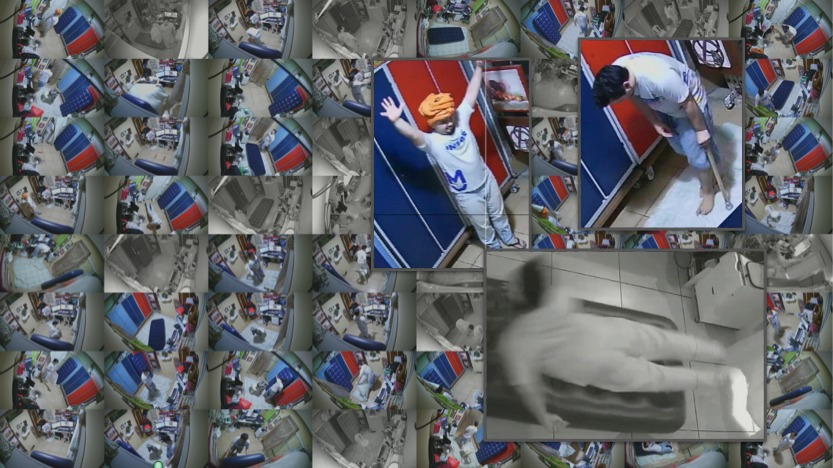

<p align="center">
  <a href="" rel="noopener">
 </a>
</p>

<h1 align="center">TsetFall dataset</h1>

<div align="center">

<!-- []()
[](https://github.com/kylelobo/The-Documentation-Compendium/issues)
[](https://github.com/kylelobo/The-Documentation-Compendium/pulls) -->
[](/LICENSE)

</div>

---

<p align="center"> Comprehensive, fine-grained, and publicly available dataset generated for fall detection research. 
    <br> 
</p>

## 📝 Table of Contents

- [About](#about)
- [Getting Started](#getting_started)
- [Download](#download)
- [Authors](#authors)
<!-- - [Acknowledgments](#acknowledgement) -->

## About <a name = "about"></a>

Human fall detection research remains an underdeveloped
area, particularly with respect to utilizing dynamic
images for analysis. Existing fall detection datasets often suffer
from size, diversity, and representativeness limitations, as they
generally comprise a small number of videos featuring a limited
range of actions, camera perspectives, and lighting conditions.
Moreover, these datasets typically lack the complexity of real-world
fall scenarios, as they often exclude distracting objects and
offer only one or two camera angles. To address these challenges,
this work introduces TsetFall, a comprehensive, fine-grained, and
publicly available dataset generated for fall detection research.
Employing a novel AI technique devised by the present authors,
the dataset annotation process was notably expedited. By bridging
the current gaps in available resources, the TsetFall dataset
serves as a valuable benchmark for advancing the field and
tackling the multifaceted nature of human fall detection.

## Getting Started <a name = "getting_started"></a>


The content is made available in the following format:

A compressed folder containing each of the images from the video sequences. The image name follows the following pattern: `camNumber__sequenceNumber-sequenceName__frameNumber.jpeg`. Example: `cam-1_1-andando-normalmente__0001.jpeg`.

A compressed folder containing the sequences arranged in video format. The image name follows the following pattern: `camNumber__sequenceNumber-sequenceName.mp4`.

The CSV file containing the annotations. Each line of the file contains the following fields:

  - Image name
  - Detection confidence
  - Class of the object of interest (No Fall, Fallen, Falling, and Confounding)
  - 4 fields containing the object's location in the format x_min, y_min, x_max, y_max
  - The algorithm that generated the detection.
```
tsetfall
├─ tsetfall.rar
│  └─ [list of images]
├─ tsetfall_videos.rar
│  └─ [list of videos]
└─ ground_truth.csv 
```
To access this content please fill the following [form](https://forms.gle/fxcDziZSrp4zL9Uc6) to aquire the decode key. You can find the download link [here](https://mega.nz/folder/u9dynToD).

## Authors <a name = "authors"></a>

- [@eduardodut](https://github.com/eduardodut)
- [@mandreia](https://github.com/mandreia)
- [@thiagoRCOliveira](https://github.com/thiagoRCOliveira)

<!-- ## 🎉 Acknowledgements <a name = "acknowledgement"></a>

- Hat tip to anyone whose code was used
- Inspiration
- References -->

