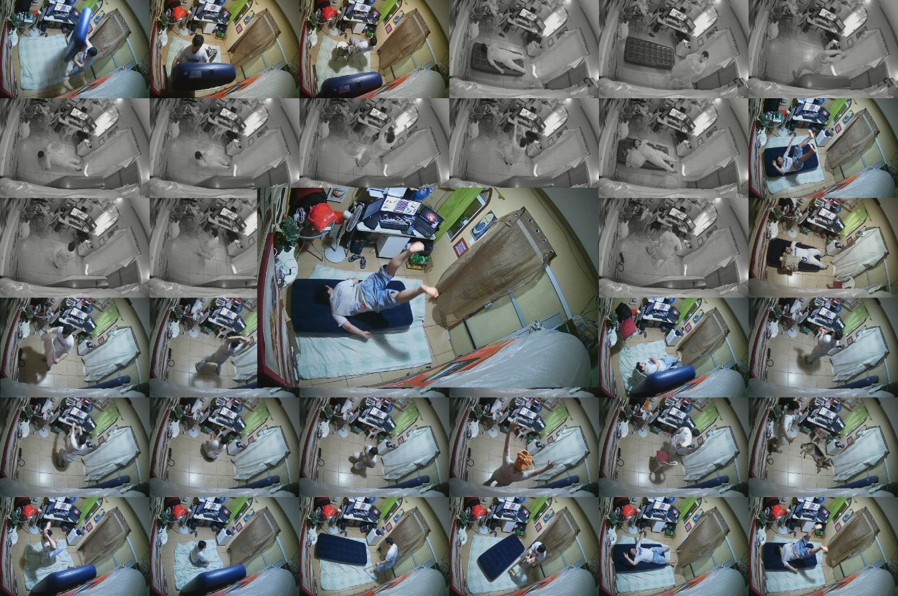

<p align="center">
  <a href="" rel="noopener">
 </a>
</p>

<h1 align="center">TsetFall dataset</h1>

<div align="center">


[](/LICENSE)

</div>

---

<p align="center">A Comprehensive, fine-grained, and publicly available dataset generated for human fall detection. <br> 
</p>

## Table of Contents

- [Table of Contents](#table-of-contents)
- [About ](#about-)
- [Data structure ](#data-structure-)
- [Video description ](#video-description-)
- [Download ](#download-)
- [Authors ](#authors-)
<!-- - [Acknowledgments](#acknowledgement) -->

## About <a name = "about"></a>

Human fall detection research remains an underdeveloped
area, particularly with respect to utilizing dynamic
images for analysis. Existing fall detection datasets often suffer
from size, diversity, and representativeness limitations, as they
generally comprise a small number of videos featuring a limited
range of actions, camera perspectives, and lighting conditions.
Moreover, these datasets typically lack the complexity of real-world
fall scenarios, as they often exclude distracting objects and
offer only one or two camera angles. To address these challenges,
this work introduces TsetFall, a comprehensive, fine-grained, and
publicly available dataset generated for fall detection research.
Employing a novel AI technique devised by the present authors,
the dataset annotation process was notably expedited. By bridging
the current gaps in available resources, the TsetFall dataset
serves as a valuable benchmark for advancing the field and
tackling the multifaceted nature of human fall detection.

## Data structure <a name = "data_description"></a>


The content is made available in the following format:
  - A folder containing our publications
  - A compressed folder containing each of the images from the video sequences. The image name follows the following pattern: `cam_number__sequenceNumber-sequenceName__frameNumber.jpeg`. Example: `cam_1__1-andando-normalmente__00001.jpeg`.

  - A compressed folder containing the sequences arranged in video format. The image name follows the following pattern: `cam_number__sequenceNumber-sequenceName.mp4`.

  - The CSV file containing the annotations performed by humans only. Each line of the file contains the following fields:

    - Image name
    - Class of the objects of interest: Not Fallen (NF), Fallen (FN), Falling (FG), and Confounding (C)
    - 4 fields containing the object's location in the format x_min, y_min, x_max, y_max

  - The CSV file containing the ia-assisted annotations. Each line of the file contains the same strucutre of the previous file, with the addition of the following fields:
    - Detection confidence
    - The algorithm that generated the detection


```
tsetfall
├─ publications
├─ tsetfall.rar
│  └─ [list of images]
├─ tsetfall_videos.rar
│  └─ [list of videos]
├─ ground_truth.csv 
└─ ground_truth_extended.csv 
```
## Video description <a name = "video_description"></a>

|#|Sequence Name (in Portuguese)|Description|
|-|-------------|-----------|
|1|andando-normalmente|Walking and interacting with objects.|
|2|desmaiando|Fainting.|
|3|deitando-nas-cadeiras|Lying on three chairs.|
|4|sentando-na-cadeira-com-gatinho|Sitting in a chair with a kitten by the side.|
|5|sentando-no-chao|Sitting on the floor.|
|6|andando-com-bengala |Walking with a cane, followed by a fall.|
|7|andando-com-anda-ja|Walking with a walker, followed by a fall.|
|8|caindo-de-costas|Falling backwards.|
|9|caindo-de-barriga|Falling forward.|
|10|andando-com-casaco-na-cadeira|Walking and interacting with objects, with a coat hanging on a chair.|
|11|sentando-com-casaco-na-cadeira|Sitting on a chair located next to another chair with a coat hanging on it.|
|12|cair-no-escuro|Falling forward in the dark.|
|13|teste-da-camisa-de-botoes|Handling a button-up shirt on a hanger in the dark.|
|14|polichinelo-no-escuro|Jumping jacks exercise in the dark.|
|15|apoio-de-frente-escuro|Front support exercise in the dark.|
|16|abdominal-no-escuro|Abdominal exercise in the dark.|
|17|flexao-com-pesos-no-escuro|Push-ups with weights exercise in the dark.|
|18|agachamentos-no-escuro|Squats exercise in the dark.|
|19|queda-com-manequim-no-escuro|Falling backwards while holding a mannequin torso in the dark.|
|20|entrar-agachar-e-para-no-escuro|Walking to the center of the room, squatting down, standing up, and exiting, all in the dark.|
|21|andar-agachado-no-escuro|Walking crouched in the dark.|
|22|andar-com-toalha-turban-no-escuro|Walking with a towel turban in the dark.|
|23|sentar-e-com-dificuldade|Sit-stand with difficulty in a chair.|
|24|sentar-levantar-com-dificuldade-no-escuro|Sit-stand with difficulty in a chair in the dark.|
|25|queda-com-manequim|Falling backwards while holding a mannequin torso.|
|26|teste-camisa-com-botoes|Handling a button-up shirt on a hanger.|
|27|polichinelos|Jumping jacks exercise.|
|28|apoio-de-frente|Front support exercise.|
|29|abdominal|Abdominal exercise.|
|30|flexao-com-pesos|Push-ups with weights exercise.|
|31|agachamento|Squats exercise.|
|32|entrar-e-agachar|Walking to the center of the room and squatting down.|
|33|andar-agachado|Walking crouched.|
|34|toalha-na-cabeca|Walking with a towel turban.|
|35|sentar-levantar-com-dificuldade|Struggling to walk with hands behind the back, then sitting, standing, and leaving the room.|
|36|teste-com-cachorro|Walking and interacting with a dog.|


## Download <a name = "download"></a>
 
 To access this content, please complete the following [form](https://forms.gle/fxcDziZSrp4zL9Uc6) to acquire the decoding key. You can find the download link [here](https://mega.nz/folder/u9dynToD).

## Authors <a name = "authors"></a>

- [@eduardodut](https://github.com/eduardodut)
- [@mandreia](https://github.com/mandreia)
- [@thiagoRCOliveira](https://github.com/thiagoRCOliveira)


